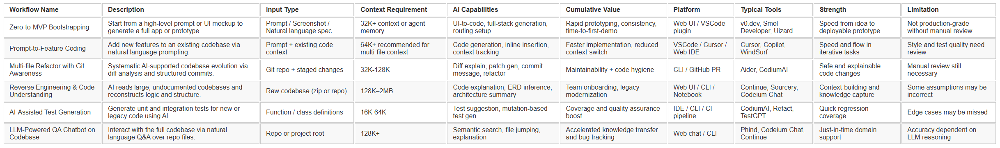

# Ideális AI-fejlesztői munkafolyamatok – Felülnézeti áttekintés

Ez a cikk egy **idealizált** fejlesztői munkafolyamat-készletet mutat be, amely az **AI-val támogatott szoftverfejlesztés**-re épül. A mellékelt (angol nyelvű) táblázat minden sora egy koherens és ellentmondásmentes AI-funkcionalitás- és fejlesztői attitűd-kombinációt képvisel.

Ezek a munkafolyamatok nem egy-egy konkrét termék vagy IDE funkciói. Valójában ma nincs olyan eszköz, amely teljes mértékben lefedné az összes felsorolt szempontot. Ugyanakkor minden szereplő funkció és gyakorlat már legalább egy létező termékben **implementálva** van.

A cél, hogy a mérnökcsapatok, eszközfejlesztők és AI-stratégák jobban átlássák a generatív modellekkel támogatott szoftverfejlesztés **gyakorlati határait és lehetőségeit** – az ötlettől a tesztelésen át a karbantartásig.

## Zero-to-MVP Bootstrapping
Ez a munkafolyamat egy termékötlet első szikrájára fókuszál. Nincs még kód, az AI egy működő MVP-t (minimum viable product) generál egy leírás vagy akár egy UI screenshot alapján. 
Ide tartozik a felhasználói felület elrendezése, API-vázlatok és egyszerű adatmodellek létrehozása. A v0.dev és a Smol Developer jó példák erre. 
A hangsúly a sebességen és az átláthatóságon van, nem a gyártási minőségen. 
Alkalmas olyan alapítók vagy designerek számára, akik gyorsan akarnak koncepciót validálni kódolás nélkül. 
Fő erőssége, hogy az ötlet és a bemutatható prototípus közötti időt közel nullára csökkenti.

## Prompt-to-Feature Coding
Ez a munkafolyamat meglévő projektet feltételez, ahol az AI segít új funkciók bevezetésében. 
A fejlesztő természetes nyelven leírja a kívánt változtatást, az asszisztens pedig generálja a szükséges kódrészeket. 
Ez megőrzi a mentális fókuszt, és jelentősen csökkenti a rutinfeladatok terhét. 
Ideális önálló fejlesztőknek vagy kis csapatoknak, akik hatékonyan szeretnének skálázódni. 
A legnagyobb érték az iteratív fejlesztés gyorsaságában és a visszacsatolás rövid ciklusaiban rejlik.

## Multi-file Refactor with Git Awareness
Ez a munkafolyamat a fenntartható kódminőséget célozza. 
Az AI elemzi a változásokat, commit-üzenetet generál, és több fájlra kiterjedő refaktorálási javaslatokat tesz. 
Nem a nulláról generál kódot, hanem a meglévőt rendezi újra. 
Jól működik érettebb csapatoknál, ahol hosszú távú karbantarthatóság a cél. 
Az Aider ebben a paradigmában kiemelkedő szereplő.

## Reverse Engineering & Code Understanding
Ez a munkafolyamat az "előbb olvasd el" elvű megközelítés csúcsa – meglévő, de nehezen érthető kódhoz ideális. 
Hasznos régi rendszerek migrálásánál, akvizíciók technikai átvilágításánál, vagy új fejlesztők betanításánál. 
Az AI végigolvassa a projektet, és következtet az architektúrára, modulkapcsolatokra, dokumentációra. 
A nyereség exponenciális: napok kézi feltérképezés helyett órák. 
A kihívás, hogy az AI által alkotott absztrakció mennyire fedi a valós működést.

## AI-Assisted Test Generation
Ebben a munkafolyamatban az AI teszteseteket javasol vagy generál. 
Lehet új funkciókhoz egységtesztet írni, vagy régi modulokhoz lefedettséget javítani. 
Segít a TDD (test-driven development) elvek követésében még szoros határidők mellett is. 
Hasznos refaktoráláskor is, amikor visszacsatolási hálót ad a fejlesztőnek. 
Növeli a biztonságot, és csökkenti a regresszió esélyét.

## LLM-Powered QA Chatbot on Codebase
Ez a munkafolyamat egy beszélgetésalapú interfészt biztosít a teljes kódbázishoz. 
A fejlesztő kérdéseket tehet fel: „Hol van ez a függvény használva?”, „Hogy néz ki az authentikációs folyamat?”, „Hogyan történik a fizetés?” 
Különösen hasznos hibakeresés, betanítás vagy visszafejtés során. 
Órák manuális keresését helyettesíti szemantikus lekérdezésekkel. 
Hatékonysága a context window méretétől és az LLM érvelési képességétől is függ.

| Workflow Name                            | Description                                                                          | Input Type                                  | Context Requirement                     | AI Capabilities                                       | Cumulative Value                                   | Platform                  | Typical Tools                    | Strength                                | Limitation                                 |
|:-----------------------------------------|:-------------------------------------------------------------------------------------|:--------------------------------------------|:----------------------------------------|:------------------------------------------------------|:---------------------------------------------------|:--------------------------|:---------------------------------|:----------------------------------------|:-------------------------------------------|
| Zero-to-MVP Bootstrapping                | Start from a high-level prompt or UI mockup to generate a full app or prototype.     | Prompt / Screenshot / Natural language spec | 32K+ context or agent memory            | UI-to-code, full-stack generation, routing setup      | Rapid prototyping, consistency, time-to-first-demo | Web UI / VSCode plugin    | v0.dev, Smol Developer, Uizard   | Speed from idea to deployable prototype | Not production-grade without manual review |
| Prompt-to-Feature Coding                 | Add new features to an existing codebase via natural language prompting.             | Prompt + existing code context              | 64K+ recommended for multi-file context | Code generation, inline insertion, context tracking   | Faster implementation, reduced context-switch      | VSCode / Cursor / Web IDE | Cursor, Copilot, WindSurf        | Speed and flow in iterative tasks       | Style and test quality need review         |
| Multi-file Refactor with Git Awareness   | Systematic AI-supported codebase evolution via diff analysis and structured commits. | Git repo + staged changes                   | 32K-128K                                | Diff explain, patch gen, commit message, refactor     | Maintainability + code hygiene                     | CLI / GitHub PR           | Aider, CodiumAI                  | Safe and explainable code changes       | Manual review still necessary              |
| Reverse Engineering & Code Understanding | AI reads large, undocumented codebases and reconstructs logic and structure.         | Raw codebase (zip or repo)                  | 128K–2MB                                | Code explanation, ERD inference, architecture summary | Team onboarding, legacy modernization              | Web UI / CLI / Notebook   | Continue, Sourcery, Codeium Chat | Context-building and knowledge capture  | Some assumptions may be incorrect          |
| AI-Assisted Test Generation              | Generate unit and integration tests for new or legacy code using AI.                 | Function / class definitions                | 16K-64K                                 | Test suggestion, mutation-based test gen              | Coverage and quality assurance boost               | IDE / CLI / CI pipeline   | CodiumAI, Refact, TestGPT        | Quick regression coverage               | Edge cases may be missed                   |
| LLM-Powered QA Chatbot on Codebase       | Interact with the full codebase via natural language Q&A over repo files.            | Repo or project root                        | 128K+                                   | Semantic search, file jumping, explanation            | Accelerated knowledge transfer and bug tracking    | Web chat / CLI            | Phind, Codeium Chat, Continue    | Just-in-time domain support             | Accuracy dependent on LLM reasoning        |

