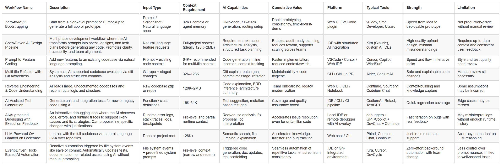

# Ideal AI Developer Workflows – Top-Down Overview

Apologies — life moved faster than my post. The previous version became outdated within hours. Here’s the updated and expanded one.

This article presents an **idealized** set of developer workflows, centered around **AI-enhanced software development**. Each row in the accompanying table represents a coherent and non-conflicting combination of AI-assisted functionalities and developer attitudes. 

These workflows are not designed to map one-to-one with any single product or IDE. In fact, no single tool today can fully support every aspect listed in each row. However, all the included features and practices are already **implemented** in at least one real-world product or platform.

The goal of this overview is to help engineering teams, tool builders, and AI strategists better understand the **practical boundaries and opportunities** of LLM-driven software development—from bootstrapping to testing and maintenance.

## Zero-to-MVP Bootstrapping
This workflow focuses on the initial spark of a product idea. It assumes that no code exists yet, and the AI system can generate a working MVP (minimum viable product) based on a textual description or even a screenshot. It may involve UI layouting, API stubs, and simple data models generated from natural language. Tools like v0.dev and Smol Developer are great examples. The focus is on speed, clarity, and usability over robustness or production-readiness. This method is ideal for founders or designers who want to validate concepts quickly without writing code manually. Its main strength lies in reducing the time between ideation and demonstration to near-zero.

## Spec-Driven AI Design Pipeline
This workflow brings structure to AI-assisted development by explicitly separating prompting from implementation. It introduces a planning layer where the AI first turns a prompt into formal requirements, user stories, and acceptance criteria. Next, a design document is generated — including architecture, interfaces, data flows, and schemas — before any code is written. Finally, the AI produces an implementation plan with task breakdowns. This mode is ideal for teams working on high-stakes or collaborative projects, where clarity and documentation are critical. Kiro by Amazon is pioneering this approach, turning AI into a true planning assistant, not just a code generator.

## Prompt-to-Feature Coding
This workflow assumes an existing project, where AI helps incrementally implement new features. The developer describes the desired change or module via prompt, and the assistant generates the necessary code blocks in context. It preserves mental flow and significantly reduces boilerplate. Ideal for solo developers or small teams looking to scale without burnout. The biggest gain comes from reduced friction in exploratory coding, and faster feedback cycles.

## Multi-file Refactor with Git Awareness
This workflow aims for sustainable code quality. It leverages AI to analyze diffs, generate commit messages, and suggest multi-file refactoring patterns. Rather than generating code from scratch, it focuses on clean restructuring of what’s already there. This model works well for mature teams handling complex codebases with long-term maintainability concerns. Aider is a clear frontrunner in this paradigm.

## Reverse Engineering & Code Understanding
This is the ultimate “read-first” workflow, designed for cases where the code exists but understanding is limited. It’s useful in legacy migrations, M&A audits, or onboarding new devs onto large projects. AI reads through thousands of lines to infer architectural intent, module relations, and documentation. The gain is exponential: days of manual exploration reduced to hours. The challenge is making sure the AI’s abstraction is grounded in the actual code logic.

## AI-Assisted Test Generation
Here, AI supports quality assurance by suggesting or generating test cases. It may generate unit tests for new functions or fill coverage gaps in legacy modules. This helps teams enforce test-driven development (TDD) principles, even under time pressure. It also adds safety nets during refactors, which is vital in fast-moving teams. The approach improves confidence and reduces regression risks.

## AI-Augmented Debugging with Execution Feedback
This workflow injects AI into the runtime debugging loop. Rather than relying solely on code context, the AI observes logs, exceptions, and stack traces to infer what went wrong. It suggests likely causes, proposes changes, and explains its reasoning line-by-line. This is especially valuable in unfamiliar or high-complexity systems where mental model gaps are common. The AI can also translate cryptic error messages into actionable insights, or help construct test cases from bug patterns. While still in early stages, this niche is rapidly evolving — tools like DevChat and Copilot with debug extensions are leading the way.

## LLM-Powered QA Chatbot on Codebase
This workflow introduces a conversational interface to the codebase. Developers can ask questions like “Where is this function used?”, “What’s the auth flow?”, or “How are payments handled?”. This is particularly powerful during debugging, onboarding, or reverse engineering. It replaces hours of manual searching with semantic lookup. Its effectiveness depends on context window size, but also the reasoning power of the LLM.

## Event-Driven Hook-Based AI Automation
This workflow treats development as a series of observable events, such as file saves, commits, or new components. Hooks are defined in natural language to automate actions like test generation, documentation updates, or storybook integration. When the event fires, an AI agent reacts in real time — applying the change or updating a related artifact. This approach minimizes cognitive load by offloading repetitive tasks while ensuring consistency. Hooks are saved as versioned code files, enabling teams to share automation policies across projects. It’s a perfect fit for DevOps-minded engineers looking to embed AI deeper into their delivery pipeline.

* * *

## Explanation of the Row Sequence in the Table  
The proposed sequence reflects a “wing-to-wing” AI development workflow — starting from ideation and structured planning, through implementation and testing, and ending in automation and ongoing maintenance. Each step builds logically on the previous, ensuring both velocity and sustainability in AI-assisted coding.

| 🔢  | **Workflow**                                       | **Short Explanation**                                                                      |
| --- | -------------------------------------------------- | ------------------------------------------------------------------------------------------ |
| 1️⃣ | **Zero-to-MVP Bootstrapping**                      | Brand new project built from scratch up to MVP.                                            |
| 2️⃣ | **Spec-Driven AI Design Pipeline**                 | Structured design phase before any coding begins.                                          |
| 3️⃣ | **Prompt-to-Feature Coding**                       | Daily AI-based prompting for individual features.                                          |
| 4️⃣ | **Multi-file Refactor with Git Awareness**         | Brings order to generated or chaotic codebases.                                            |
| 5️⃣ | **Reverse Engineering & Code Understanding**       | Mapping out code we didn’t write ourselves.                                                |
| 6️⃣ | **AI-Assisted Test Generation**                    | Letting AI write tests for new or modified code.                                           |
| 7️⃣ | **AI-Augmented Debugging with Execution Feedback** | Identifying and fixing bugs based on runtime feedback (logs, stack trace, AI suggestions). |
| 8️⃣ | **LLM-Powered QA Chatbot on Codebase**             | Question–answer support for a live system.                                                 |
| 9️⃣ | **Event-Driven Hook-Based AI Automation**          | Automated post-processing triggered by development events.                                 |

| Workflow Name | Description | Input Type | Context Requirement | AI Capabilities | Cumulative Value | Platform | Typical Tools | Strength | Limitation |
|:-----------------------------------------|:-------------------------------------------------------------------------------------|:--------------------------------------------|:----------------------------------------|:------------------------------------------------------|:---------------------------------------------------|:--------------------------|:---------------------------------|:----------------------------------------|:-------------------------------------------|
| Zero-to-MVP Bootstrapping                | Start from a high-level prompt or UI mockup to generate a full app or prototype.     | Prompt / Screenshot / Natural language spec | 32K+ context or agent memory            | UI-to-code, full-stack generation, routing setup      | Rapid prototyping, consistency, time-to-first-demo | Web UI / VSCode plugin    | v0.dev, Smol Developer, Uizard   | Speed from idea to deployable prototype | Not production-grade without manual review |
| Spec-Driven AI Design Pipeline        | Multi-phase development workflow where the AI transforms prompts into specs, designs, and task plans before generating any code. Promotes clarity, traceability, and team alignment. | Natural language feature requests              | Full-project context (ideally 128K–2MB) | Requirement extraction, architectural analysis, structured task planning | Enables audit-ready planning, reduces rework, supports scaling across teams | IDE with structured AI integration | Kiro (Amazon), custom AI IDEs | High-quality upfront design, minimal misunderstandings | Requires up-to-date context and consistent user feedback      |
| Prompt-to-Feature Coding                 | Add new features to an existing codebase via natural language prompting.             | Prompt + existing code context              | 64K+ recommended for multi-file context | Code generation, inline insertion, context tracking   | Faster implementation, reduced context-switch      | VSCode / Cursor / Web IDE | Cursor, Copilot, WindSurf        | Speed and flow in iterative tasks       | Style and test quality need review         |
| Multi-file Refactor with Git Awareness   | Systematic AI-supported codebase evolution via diff analysis and structured commits. | Git repo + staged changes                   | 32K-128K                                | Diff explain, patch gen, commit message, refactor     | Maintainability + code hygiene                     | CLI / GitHub PR           | Aider, CodiumAI                  | Safe and explainable code changes       | Manual review still necessary              |
| Reverse Engineering & Code Understanding | AI reads large, undocumented codebases and reconstructs logic and structure.         | Raw codebase (zip or repo)                  | 128K–2MB                                | Code explanation, ERD inference, architecture summary | Team onboarding, legacy modernization              | Web UI / CLI / Notebook   | Continue, Sourcery, Codeium Chat | Context-building and knowledge capture  | Some assumptions may be incorrect          |
| AI-Assisted Test Generation              | Generate unit and integration tests for new or legacy code using AI.                 | Function / class definitions                | 16K-64K                                 | Test suggestion, mutation-based test gen              | Coverage and quality assurance boost               | IDE / CLI / CI pipeline   | CodiumAI, Refact, TestGPT        | Quick regression coverage               | Edge cases may be missed                   |
| AI-Augmented Debugging with Execution Feedback | An interactive debugging loop where the AI observes logs, errors, and runtime traces to suggest likely causes and fix strategies. Can propose line-specific changes with justifications. | Runtime error logs, stack traces, logs, breakpoints | File-level and partial runtime context | Root-cause analysis, fix proposal, log interpretation | Accelerates issue resolution, even for unfamiliar code | Local IDE or remote debugger with AI overlay | debuggers + GPT/Copilot + DevChat + Continue | Fast iteration on bugs with real feedback | May misinterpret logs without enough runtime history |
| LLM-Powered QA Chatbot on Codebase       | Interact with the full codebase via natural language Q&A over repo files.            | Repo or project root                        | 128K+                                   | Semantic search, file jumping, explanation            | Accelerated knowledge transfer and bug tracking    | Web chat / CLI            | Phind, Codeium Chat, Continue    | Just-in-time domain support             | Accuracy dependent on LLM reasoning        |
| Event-Driven Hook-Based AI Automation | Reactive automation triggered by file system events like save or commit. Automatically updates tests, documentation, or related assets using AI without manual prompting.            | File system events + predefined system prompts | File-level context (narrow and recent)  | Triggered code generation, doc updates, test scaffolding                 | Seamless automation of repetitive tasks, ensures team consistency           | IDE or Git-integrated environment  | Kiro, Cursor, DevCycle        | Zero-effort background automation with team sharing    | Less control over prompt nuance; limited to well-scoped tasks |

