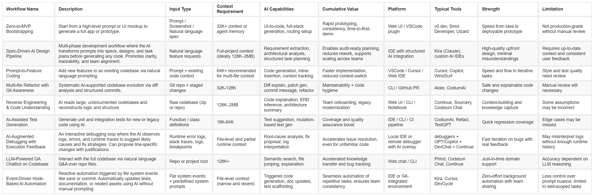

# Ideális AI-fejlesztői munkafolyamatok – Felülnézeti áttekintés  

Sajnálom, de az élet gyorsabb volt nálam — a korábbi posztom néhány óra alatt elavult. Ez itt a **frissített, kibővített verzió**.  

Ez a cikk egy **idealizált** fejlesztői munkafolyamat-készletet mutat be, amely az **AI-val támogatott szoftverfejlesztés**-re épül. A mellékelt (angol nyelvű) táblázat minden sora egy koherens és ellentmondásmentes AI-funkcionalitás- és fejlesztői attitűd-kombinációt képvisel.  

Ezek a munkafolyamatok nem egy-egy konkrét termék vagy IDE funkciói. Valójában ma nincs olyan eszköz, amely teljes mértékben lefedné az összes felsorolt szempontot. Ugyanakkor minden szereplő funkció és gyakorlat már legalább egy létező termékben **implementálva** van.  

A cél, hogy a mérnökcsapatok, eszközfejlesztők és AI-stratégák jobban átlássák a generatív modellekkel támogatott szoftverfejlesztés **gyakorlati határait és lehetőségeit** – az ötlettől a tesztelésen át a karbantartásig.  

## Zero-to-MVP Bootstrapping
Ez a munkafolyamat egy termékötlet első szikrájára fókuszál. Nincs még kód, az AI egy működő MVP-t (=Minimum Viable Product) generál egy leírás vagy akár egy UI screenshot alapján. Ide tartozik a felhasználói felület elrendezése, API-vázlatok és egyszerű adatmodellek létrehozása. A v0.dev és a Smol Developer jó példák erre. A hangsúly a sebességen és az átláthatóságon van, nem a gyártási minőségen. Alkalmas olyan alapítók vagy designerek számára, akik gyorsan akarnak koncepciót validálni kódolás nélkül. Fő erőssége, hogy az ötlet és a bemutatható prototípus közötti időt közel nullára csökkenti.

## Spec-alapú AI tervezési folyamat 
(Spec-Driven AI Design Pipeline)  
Ez a munkafolyamat szerkezetet visz az AI-támogatott fejlesztésbe azáltal, hogy világosan elválasztja a promptolást a megvalósítástól. Bevezet egy tervezési réteget, ahol az AI először formális követelményekké, felhasználói történetekké és elfogadási kritériumokká alakítja a promptot. Ezután elkészíti a dizájn dokumentumot — amely tartalmazza az architektúrát, interfészeket, adatfolyamokat és sémákat — még mielőtt egy sor kód is megíródna. Végül az AI létrehozza a megvalósítási tervet részfeladatokra bontva. Ez az üzemmód ideális olyan csapatok számára, akik kritikus vagy együttműködésen alapuló projekteken dolgoznak, ahol kiemelten fontos az átláthatóság és a dokumentáció. Az Amazon által fejlesztett Kiro úttörő ebben a megközelítésben, amely az AI-t valódi tervezési asszisztenssé teszi, nem csupán kódgeneráló eszközzé.

## Prompt-to-Feature Coding
Ez a munkafolyamat meglévő projektet feltételez, ahol az AI segít új funkciók bevezetésében. A fejlesztő természetes nyelven leírja a kívánt változtatást, az asszisztens pedig generálja a szükséges kódrészeket. Ez megőrzi a mentális fókuszt, és jelentősen csökkenti a rutinfeladatok terhét. Ideális önálló fejlesztőknek vagy kis csapatoknak, akik hatékonyan szeretnének skálázódni. A legnagyobb érték az iteratív fejlesztés gyorsaságában és a visszacsatolás rövid ciklusaiban rejlik.

## Multi-file Refactor with Git Awareness
Ez a munkafolyamat a fenntartható kódminőséget célozza. Az AI elemzi a változásokat, commit-üzenetet generál, és több fájlra kiterjedő refaktorálási javaslatokat tesz. Nem a nulláról generál kódot, hanem a meglévőt rendezi újra. Jól működik érettebb csapatoknál, ahol hosszú távú karbantarthatóság a cél. Az Aider ebben a paradigmában kiemelkedő szereplő.

## Reverse Engineering & Code Understanding
Ez a munkafolyamat az "előbb olvasd el" elvű megközelítés csúcsa – meglévő, de nehezen érthető kódhoz ideális. Hasznos régi rendszerek migrálásánál, akvizíciók technikai átvilágításánál, vagy új fejlesztők betanításánál. Az AI végigolvassa a projektet, és következtet az architektúrára, modulkapcsolatokra, dokumentációra. A nyereség exponenciális: napok kézi feltérképezés helyett órák. A kihívás, hogy az AI által alkotott absztrakció mennyire fedi a valós működést.

## AI-Assisted Test Generation
Ebben a munkafolyamatban az AI teszteseteket javasol vagy generál. Lehet új funkciókhoz egységtesztet írni, vagy régi modulokhoz lefedettséget javítani. Segít a TDD (test-driven development) elvek követésében még szoros határidők mellett is. Hasznos refaktoráláskor is, amikor visszacsatolási hálót ad a fejlesztőnek. Növeli a biztonságot, és csökkenti a regresszió esélyét.

## AI-támogatott hibakeresés futásidejű visszajelzésekkel
(AI-Augmented Debugging with Execution Feedback)  
Ez a munkafolyamat az AI-t a futásidejű hibakeresési ciklusba ágyazza be. Ahelyett, hogy csak a kódszövegre támaszkodna, az AI figyeli a logokat, kivételeket és veremnyomokat, hogy következtessen arra, mi romlott el. Javaslatokat tesz a lehetséges okokra, változtatásokat ajánl, és lépésről lépésre elmagyarázza a gondolatmenetét. Ez különösen értékes ismeretlen vagy nagy komplexitású rendszerek esetén, ahol a fejlesztő mentális modellje még nem épült ki. Az AI képes a homályos hibaüzeneteket értelmezhető tanácsokká fordítani, vagy hibaminták alapján teszteseteket javasolni. Bár még korai szakaszban jár, ez a terület gyorsan fejlődik — a DevChat és a Copilot hibakeresési kiterjesztései már most is ígéretesek.

## LLM-Powered QA Chatbot on Codebase
Ez a munkafolyamat egy beszélgetésalapú interfészt biztosít a teljes kódbázishoz. A fejlesztő kérdéseket tehet fel: „Hol van ez a függvény használva?”, „Hogy néz ki az authentikációs folyamat?”, „Hogyan történik a fizetés?” Különösen hasznos hibakeresés, betanítás vagy visszafejtés során. Órák manuális keresését helyettesíti szemantikus lekérdezésekkel. Hatékonysága a context window méretétől és az LLM érvelési képességétől is függ.

## Eseményvezérelt, hook-alapú AI automatizálás
(Event-Driven Hook-Based AI Automation)  
Ez a munkafolyamat úgy kezeli a fejlesztést, mint események sorozatát — például fájlmentés, commit, vagy új komponens létrehozása. A hookokat természetes nyelven lehet definiálni, hogy automatizálják az olyan lépéseket, mint a tesztgenerálás, dokumentációfrissítés vagy storybook integráció. Amikor az esemény bekövetkezik, az AI-ügynök valós időben reagál — elvégzi a módosítást vagy frissíti a kapcsolódó fájlokat. Ez a megközelítés csökkenti a mentális terhelést az ismétlődő feladatok kiiktatásával, miközben biztosítja a konzisztenciát. A hookok verziózott fájlként kerülnek mentésre a kódbázisba, így a csapatok megoszthatják egymással az automatizálási szabályokat. Különösen jól illik a DevOps-szemléletű mérnökökhöz, akik mélyebben szeretnék beágyazni az AI-t a szállítási folyamatukba.

## Magyarázat a táblázat sorainak sorrendjéhez  
A javasolt sorrend egy „faltól falig” AI-fejlesztési munkafolyamatot tükröz – az ötlettől és strukturált tervezéstől indul, végighalad a megvalósításon és tesztelésen, majd eljut az automatizálásig és a fenntartásig. Minden lépés az előzőre épül, így biztosítva a gyorsaságot és a fenntarthatóságot az AI-támogatott fejlesztésben.

| 🔢      | Workflow                                           | Rövid magyarázat                                                                                            |
| ------- | -------------------------------------------------- | ----------------------------------------------------------------------------------------------------------- |
| 1️⃣     | Zero-to-MVP Bootstrapping                          | Új projekt nulláról, MVP szintig.                                                                           |
| 2️⃣     | Spec-alapú AI tervezési folyamat                   | Strukturált tervezés, kódolás előtt.                                                                        |
| 3️⃣     | Prompt-to-Feature Coding                           | Napi AI-alapú promptolás funkciókra.                                                                        |
| 4️⃣     | Multi-file Refactor with Git Awareness             | Rendet tesz a generált vagy kaotikus kódban.                                                                |
| 5️⃣     | Reverse Engineering & Code Understanding           | Kód feltérképezése, ha nem mi írtuk.                                                                        |
| 6️⃣     | AI-Assisted Test Generation                        | Tesztek íratása új/módosított kódhoz.                                                                       |
| 7️⃣     | AI-támogatott hibakeresés futásidejű visszajelzésekkel  | Hibák azonosítása és javítása futás közbeni visszajelzések alapján (logok, stack trace, AI-javaslatok).    |
| 8️⃣     | LLM-Powered QA Chatbot on Codebase                 | Kérdezz-felelek működő rendszerhez.                                                                         |
| 9️⃣     | Eseményvezérelt, hook-alapú AI automatizálás       | Automatizált utófeldolgozás fejlesztési eseményekre.                                                        |

| Workflow Name | Description | Input Type | Context Requirement | AI Capabilities | Cumulative Value | Platform | Typical Tools | Strength | Limitation |
|:-----------------------------------------|:-------------------------------------------------------------------------------------|:--------------------------------------------|:----------------------------------------|:------------------------------------------------------|:---------------------------------------------------|:--------------------------|:---------------------------------|:----------------------------------------|:-------------------------------------------|
| Zero-to-MVP Bootstrapping                | Start from a high-level prompt or UI mockup to generate a full app or prototype.     | Prompt / Screenshot / Natural language spec | 32K+ context or agent memory            | UI-to-code, full-stack generation, routing setup      | Rapid prototyping, consistency, time-to-first-demo | Web UI / VSCode plugin    | v0.dev, Smol Developer, Uizard   | Speed from idea to deployable prototype | Not production-grade without manual review |
| Spec-Driven AI Design Pipeline        | Multi-phase development workflow where the AI transforms prompts into specs, designs, and task plans before generating any code. Promotes clarity, traceability, and team alignment. | Natural language feature requests              | Full-project context (ideally 128K–2MB) | Requirement extraction, architectural analysis, structured task planning | Enables audit-ready planning, reduces rework, supports scaling across teams | IDE with structured AI integration | Kiro (Amazon), custom AI IDEs | High-quality upfront design, minimal misunderstandings | Requires up-to-date context and consistent user feedback      |
| Prompt-to-Feature Coding                 | Add new features to an existing codebase via natural language prompting.             | Prompt + existing code context              | 64K+ recommended for multi-file context | Code generation, inline insertion, context tracking   | Faster implementation, reduced context-switch      | VSCode / Cursor / Web IDE | Cursor, Copilot, WindSurf        | Speed and flow in iterative tasks       | Style and test quality need review         |
| Multi-file Refactor with Git Awareness   | Systematic AI-supported codebase evolution via diff analysis and structured commits. | Git repo + staged changes                   | 32K-128K                                | Diff explain, patch gen, commit message, refactor     | Maintainability + code hygiene                     | CLI / GitHub PR           | Aider, CodiumAI                  | Safe and explainable code changes       | Manual review still necessary              |
| Reverse Engineering & Code Understanding | AI reads large, undocumented codebases and reconstructs logic and structure.         | Raw codebase (zip or repo)                  | 128K–2MB                                | Code explanation, ERD inference, architecture summary | Team onboarding, legacy modernization              | Web UI / CLI / Notebook   | Continue, Sourcery, Codeium Chat | Context-building and knowledge capture  | Some assumptions may be incorrect          |
| AI-Assisted Test Generation              | Generate unit and integration tests for new or legacy code using AI.                 | Function / class definitions                | 16K-64K                                 | Test suggestion, mutation-based test gen              | Coverage and quality assurance boost               | IDE / CLI / CI pipeline   | CodiumAI, Refact, TestGPT        | Quick regression coverage               | Edge cases may be missed                   |
| AI-Augmented Debugging with Execution Feedback | An interactive debugging loop where the AI observes logs, errors, and runtime traces to suggest likely causes and fix strategies. Can propose line-specific changes with justifications. | Runtime error logs, stack traces, logs, breakpoints | File-level and partial runtime context | Root-cause analysis, fix proposal, log interpretation | Accelerates issue resolution, even for unfamiliar code | Local IDE or remote debugger with AI overlay | debuggers + GPT/Copilot + DevChat + Continue | Fast iteration on bugs with real feedback | May misinterpret logs without enough runtime history |
| LLM-Powered QA Chatbot on Codebase       | Interact with the full codebase via natural language Q&A over repo files.            | Repo or project root                        | 128K+                                   | Semantic search, file jumping, explanation            | Accelerated knowledge transfer and bug tracking    | Web chat / CLI            | Phind, Codeium Chat, Continue    | Just-in-time domain support             | Accuracy dependent on LLM reasoning        |
| Event-Driven Hook-Based AI Automation | Reactive automation triggered by file system events like save or commit. Automatically updates tests, documentation, or related assets using AI without manual prompting.            | File system events + predefined system prompts | File-level context (narrow and recent)  | Triggered code generation, doc updates, test scaffolding                 | Seamless automation of repetitive tasks, ensures team consistency           | IDE or Git-integrated environment  | Kiro, Cursor, DevCycle        | Zero-effort background automation with team sharing    | Less control over prompt nuance; limited to well-scoped tasks |

